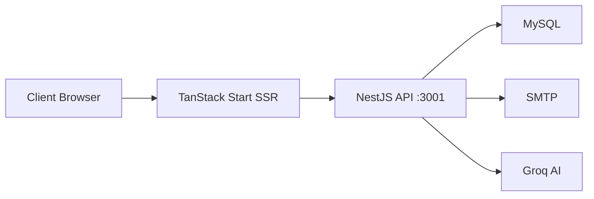

<div align="center">
  <br/>
  <h1>StirForma</h1>
  <p><strong>Plateforme de gestion de formations professionnelles</strong></p>

  <p>
    
    
    
    
  </p>

  <p>
    
    
    
    
  </p>

  <p>
    
    
    
  </p>

  <br/>
</div>

---

## Présentation

StirForma est une solution complète de gestion de formations professionnelles. Elle couvre l'intégralité du cycle de vie d'une formation : de la création du catalogue à l'émission des certificats, en passant par les inscriptions, les évaluations, la gestion des présences et la signature électronique des documents.

---

## Architecture

<div align="center">

| Couche | Technologie |
|---|---|
| **Frontend** | TanStack Start + React 19 + Tailwind CSS v4 + shadcn/ui |
| **Backend** | NestJS + TypeORM + MySQL |
| **Authentification** | JWT (access token 15 min, refresh token 7 jours) |
|

</div>

<br/>



---

## Démarrage rapide

### Backend

```bash
cd Gestion-Formation-Back
npm install
cp .env.example .env
npm run start:dev
```

> Serveur démarré sur **http://localhost:3001**

### Frontend

```bash
cd Gestion-Formation-Front
bun install
bun run dev
```

> Application accessible sur **http://localhost:8081**

### Seed

```bash
cd Gestion-Formation-Back
npx ts-node src/seed/seed.ts
```

| Rôle | Email | Mot de passe |
|---|---|---|
| Admin | `admin@formapro.fr` | `admin123` |
| Formateur | `formateur@formapro.fr` | `formateur123` |
| Participant | `participant@formapro.fr` | `participant123` |

---

## Fonctionnalités

<div align="center">

| Module | Description |
|---|---|
|  **Authentification** | Login, refresh token, protection RBAC (5 rôles) |
|  **Formations** | CRUD complet, upload images/supports, clonage cabinet → plateforme |
|  **Sessions** | Planification, assignation multi-rôle, clonage |
|  **Inscriptions** | Paiement, confirmation, historique |
|  **Évaluations** | Grille 10 critères, doublon, KPI temps réel |
|  **Présences** | Pointage par date, statut formation/cantine |
|  **Certificats** | PDF avec QR code, signature électronique |
|  **Documents** | Convention, émargement, contrat — signature multi-rôle |
|  **Notifications** | In-app + email (SMTP optionnel) |
|  **Chatbot IA** | Agent Groq pour assistance administrative |
|  **KPI Dashboard** | Satisfaction, participation, évaluations |
|  **Recherche globale** | ⌘K / Ctrl+K — command palette multi-entité |
|  **Load testing** | Script k6 inclus |

</div>

---

## API

Préfixe : `/api`

### Authentification

```
POST /api/auth/login        → { access_token, refresh_token }
POST /api/auth/refresh      → { access_token, refresh_token }
PATCH /api/auth/profile     → Mise à jour profil
```

### Catalogue & Formations

```
GET    /api/formations           → Catalogue public
GET    /api/formations/:id       → Détail formation
POST   /api/formations           → Création (admin / cabinet)
PATCH  /api/formations/:id       → Modification
DELETE /api/formations/:id       → Suppression
```

### Sessions

```
GET    /api/sessions             → Liste (auth requis)
POST   /api/sessions             → Création
PATCH  /api/sessions/:id         → Modification
DELETE /api/sessions/:id         → Suppression
```

### Utilisateurs

```
GET    /api/users/participants   → Participants
GET    /api/users/cabinets       → Cabinets (admin)
GET    /api/formateurs           → Formateurs
GET    /api/employes             → Employés
PATCH  /api/users/:id            → Modifier / activer / désactiver
```

---

## Scripts

```bash
# Backend
cd Gestion-Formation-Back
npm run start:dev       # Développement
npm run build           # Production

# Frontend
cd Gestion-Formation-Front
bun run dev             # Développement
bun run build           # Production
bun run lint            # ESLint
bun run format          # Prettier

# Load test (k6)
k6 run load-test.js
```

---

## Structure du projet

```
stir-stage/
│
├── Gestion-Formation-Back/          # NestJS — CommonJS
│   ├── src/
│   │   ├── modules/                 # 17 modules métier
│   │   │   ├── auth/                # JWT, guards
│   │   │   ├── formation/           # CRUD formations
│   │   │   ├── session/             # CRUD sessions
│   │   │   ├── inscription/         # Paiements
│   │   │   ├── evaluation/          # Évaluations
│   │   │   ├── presence/            # Présences
│   │   │   ├── certificate/         # Certificats PDF
│   │   │   ├── document/            # Documents signés
│   │   │   ├── signature/           # Signatures électroniques
│   │   │   ├── notification/        # Notifications in-app
│   │   │   ├── mail/                # Service email
│   │   │   ├── chatbot/             # IA Groq
│   │   │   └── ...
│   │   ├── entities/                # Entités TypeORM
│   │   ├── common/                  # Enums, helpers
│   │   └── seed/                    # Script de seed
│   └── uploads/                     # Fichiers uploadés
│
├── Gestion-Formation-Front/         # TanStack Start — ESM
│   ├── src/
│   │   ├── routes/                  # File-based routing
│   │   ├── components/              # Composants shadcn/ui
│   │   └── lib/api/                 # Client API typé
│   └── public/
│
└── load-test.js                     # k6 — test de charge
```

---

<div align="center">
  <br/>
  <p>
    
  </p>
  <br/>
</div>
